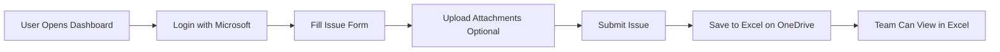

# 📊 Customer Issue Tracker Dashboard

A modern, web-based dashboard for tracking customer issues with automatic logging to Excel on OneDrive.


## ✨ Features

- 🔐 **Secure Authentication** - Microsoft Azure AD login
- 📝 **Easy Issue Logging** - Simple form interface
- 👤 **Auto-capture User Info** - Automatically logs who raised the issue
- 📎 **File Attachments** - Upload supporting documents
- 📊 **Excel Integration** - All data stored in centralized Excel file
- 🌐 **Team Access** - Accessible to everyone with Microsoft account
- 📱 **Responsive Design** - Works on desktop, tablet, and mobile
- 🎨 **Modern UI** - Clean, professional interface with Bootstrap

## 🚀 Quick Start

### Prerequisites

- Microsoft 365 account (work or school)
- OneDrive for Business access
- Azure AD app registration access
- GitHub account (for hosting)

### Setup Steps

1. **Create Excel file in OneDrive** with the required structure
2. **Register Azure AD application** for authentication
3. **Configure the application** with your Client ID and Excel IDs
4. **Deploy to GitHub Pages** for free hosting
5. **Share with your team** and start tracking issues!

📖 **[Complete Setup Guide](SETUP_GUIDE.md)** - Follow the detailed step-by-step instructions

## 📋 Excel Structure

The Excel file should have these columns:

| Timestamp | Theme | Raised By | Issue Details | Assigned To | Status | Attachments |
|-----------|-------|-----------|---------------|-------------|--------|-------------|
| Auto | Dropdown | Auto | Text | Text | Auto | Auto |

## 🎯 How It Works



## 🛠️ Technology Stack

- **Frontend**: HTML5, CSS3, JavaScript (ES6+)
- **UI Framework**: Bootstrap 5.3
- **Authentication**: Microsoft MSAL.js 2.38
- **API**: Microsoft Graph API
- **Storage**: OneDrive for Business + Excel
- **Hosting**: GitHub Pages (Free)

## 📁 Project Structure

```
customer-issue-tracker/
├── index.html          # Main dashboard UI
├── app.js             # Application logic and API integration
├── SETUP_GUIDE.md     # Detailed setup instructions
└── README.md          # This file
```

## 🔧 Configuration

### app.js Configuration

```javascript
// Azure AD Configuration
const msalConfig = {
    auth: {
        clientId: "YOUR_CLIENT_ID_HERE",
        authority: "https://login.microsoftonline.com/common",
        redirectUri: window.location.origin
    }
};

// Excel File Configuration
const EXCEL_CONFIG = {
    driveId: "YOUR_DRIVE_ID",
    itemId: "YOUR_ITEM_ID",
    worksheetName: "Issues",
    tableName: "IssuesTable"
};
```

## 🎨 Customization

### Adding New Issue Themes

Edit `index.html` around line 135:

```html
<select class="form-select" id="theme" required>
    <option value="">Select a theme...</option>
    <option value="Technical Issue">Technical Issue</option>
    <option value="Your New Theme">Your New Theme</option>
    <!-- Add more options here -->
</select>
```

### Changing Default Assignee

Edit `index.html` around line 157:

```html
<input type="text" class="form-control" id="assignedTo" value="your-alias" required>
```

### Styling

The application uses CSS custom properties for easy theming. Edit the `:root` section in `index.html`:

```css
:root {
    --primary-color: #0078d4;
    --secondary-color: #106ebe;
    --success-color: #107c10;
    --danger-color: #d13438;
}
```

## 🧪 Testing

### Demo Mode

Test the UI without Azure AD setup:

1. Open `app.js`
2. Uncomment the demo mode section at the bottom
3. Open `index.html` in a browser

### Local Testing

```bash
# Using Python
python -m http.server 8080

# Using Node.js
npx http-server -p 8080
```

Then open `http://localhost:8080` in your browser.

## 🔒 Security

- ✅ Microsoft Azure AD authentication
- ✅ OAuth 2.0 token-based authorization
- ✅ HTTPS enforced on GitHub Pages
- ✅ No sensitive data in client-side code
- ✅ Secure token storage in browser localStorage

## 📊 Data Flow

1. **User Authentication**: MSAL.js handles Microsoft login
2. **Token Acquisition**: Access token obtained for Microsoft Graph API
3. **Form Submission**: Issue data collected from form
4. **File Upload**: Attachments uploaded to OneDrive (optional)
5. **Excel Update**: Row added to Excel table via Graph API
6. **Confirmation**: Success message shown to user

## 🐛 Troubleshooting

### Common Issues

| Issue | Solution |
|-------|----------|
| Login fails | Check Client ID and redirect URI in Azure AD |
| Excel API error | Verify driveId, itemId, and table name |
| Attachments fail | Check Files.ReadWrite permission |
| Page not loading | Wait 2-3 minutes after GitHub Pages deployment |

See [SETUP_GUIDE.md](SETUP_GUIDE.md) for detailed troubleshooting.

## 📈 Future Enhancements

- [ ] Email notifications on issue submission
- [ ] Issue status updates from dashboard
- [ ] Search and filter existing issues
- [ ] Dashboard analytics and charts
- [ ] Export to PDF functionality
- [ ] Mobile app version
- [ ] Integration with Microsoft Teams

## 🤝 Contributing

Contributions are welcome! Feel free to:

1. Fork the repository
2. Create a feature branch
3. Make your changes
4. Submit a pull request

## 📄 License

This project is licensed under the MIT License - feel free to use it for your organization.

## 🙏 Acknowledgments

- Microsoft Graph API for Excel integration
- Bootstrap for the beautiful UI components
- MSAL.js for seamless authentication
- GitHub Pages for free hosting

## 📞 Support

For issues or questions:

1. Check the [SETUP_GUIDE.md](SETUP_GUIDE.md)
2. Review the troubleshooting section
3. Check Microsoft Graph API documentation
4. Open an issue in this repository

## 🎉 Success Stories

Once deployed, your team will be able to:

- ✅ Log issues in seconds from anywhere
- ✅ Track all customer issues in one place
- ✅ Collaborate using familiar Excel interface
- ✅ Access historical data for analysis
- ✅ Generate reports and insights

---

**Made with ❤️ for better customer issue tracking**

**Ready to get started?** → [Follow the Setup Guide](SETUP_GUIDE.md)
